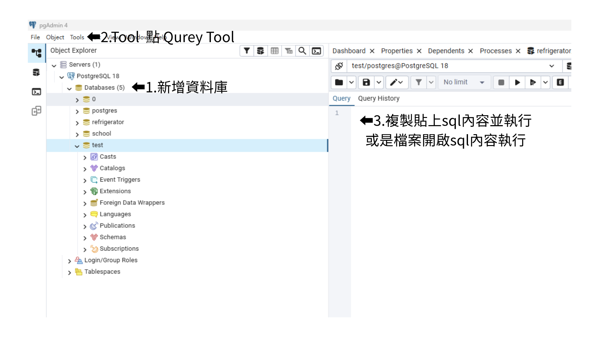

# Smart Pantry（冰箱食材管家）

## 資料庫設定

請下載或複製 `資料庫建立程式.sql`。

### 1. 建立資料庫

例如:

```sql
CREATE DATABASE refrigerator;
```

### 2. 載入資料庫建立程式

開啟 PostgreSQL 管理工具（pgAdmin），也可以使用各自熟悉的資料庫工具。



---

## 後端啟動方式

### 1. 安裝套件

```bash
pip install -r requirements.txt
```

### 2. 設定環境變數

複製 `.env.example` 並改名為 `.env`，填入自己的資料庫資訊：
DB_HOST=localhost
DB_PORT=5432
DB_NAME=refrigerator
DB_USER=postgres
DB_PASSWORD=你的密碼

### 3. 啟動後端

```bash
cd backend-project
uvicorn main:app --reload
```

### 4. 確認後端正常運作

瀏覽器前往：http://127.0.0.1:8000/docs

看到 API 文件頁面代表後端啟動成功。

---

## 前端啟動方式

### 1. 確認後端已啟動

前端需要後端同時運作才能正常顯示資料。

### 2. 用 Live Server 開啟前端

在 VSCode 對 `frontend-project/index.html` 按右鍵 → **Open with Live Server**

瀏覽器會自動開啟 Smart Pantry 網頁。

---

## 注意事項

- `.env` 檔案含有資料庫密碼，**不會上傳至 GitHub**，請自行依照 `.env.example` 建立
- 前後端都啟動後才能正常使用所有功能